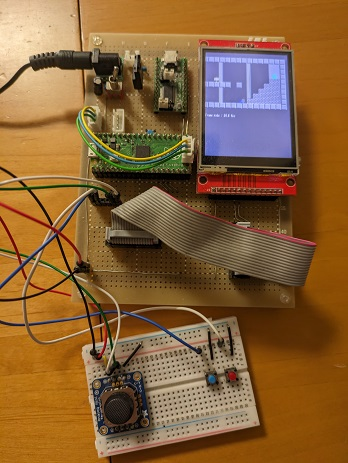

# mgc

mgcは、マイコン上で動作する小規模なゲームを開発するためのライブラリです。
16x16ピクセルのバッファを使用してイメージの重ね合わせやディスプレイへの書き込みを行うことができます。

## デモ

<div style="display: flex;">
  
  
</div>

プログラム: [samples/platformer](samples/platformer)

## 仕様
### イメージ
 - カラーフォーマット: RGB565
 - カラーモード: インデックスカラー

### フォント
 - フォントサイズ: 16ピクセル以下
 - フォントファイルフォーマット: bdf形式

## セットアップ

### samplesおよびexamplesで使用するフォントについて
samplesおよびexamplesでは、門真なむ さんの[k8x12S](https://littlelimit.net/k8x12.htm)フォントを使用します。
これらのプログラムを実行する場合は、[ダウンロードサイト](https://littlelimit.net/k8x12.htm)からX11 BDF形式のk8x12を入手し、
その中の"k8x12S.bdf"を以下のディレクトリに保存する必要があります。

```
mgc/fonts/k8x12_bdf/k8x12S.bdf
```

### 開発環境構築メモ
[SETUP.md](SETUP.md)をご参照ください。

## ライセンス

mgcはMITライセンスです。ライセンスの詳細は[LICENSE](LICENSE)ファイルをご確認ください。
ただし、tools以下のスクリプトで自動生成したコード（フォント、マップ、タイルセットなど）の取り扱いについては、
生成元データのライセンスをご確認ください。

