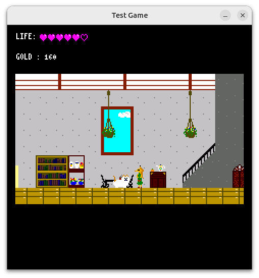

# Test Game

This is a small game created to evaluate the usability of mgc.
Through the development of this game, we are iteratively improving mgc by adding new features, refining existing ones, and fixing bugs.





## Environment

### Hardware
* **Microcontroller:** Raspberry Pi Pico (RP2040, non-Wi-Fi)
* **Display:** [Waveshare Pico-LCD-1.3](https://www.waveshare.com/wiki/Pico-LCD-1.3)
* **Audio:** External speaker connected via a **PAM8012** amplifier module to the RP2040's PWM output pin.


### Simulation
The game supports a simulation environment on PC using **SDL2**.

---
## Setup Instructions (Ubuntu 24.04)

### Common repository setup

```bash
# Install dependencies
apt update
apt install -y python3 python3-venv git

# Set up Python environment
python3 -m venv .venv
source .venv/bin/activate
pip install pyyaml pillow

# Clone the repository
git clone https://github.com/nyannkov/mgc.git
cd mgc
git submodule update --init --recursive
python3 scripts/setup_assets.py
```

### Hardware Environment Setup and Execution

To build for the Raspberry Pi Pico, the Pico SDK is required.

```bash
apt install -y wget

# Set up Pico SDK (optional script)
wget https://raw.githubusercontent.com/raspberrypi/pico-setup/master/pico_setup.sh
chmod +x pico_setup.sh
./pico_setup.sh

# Build the project
cd devtest/test_game
./build.sh
```
Copy ./build/test_game.elf.uf2 to your Raspberry Pi Pico by dragging and dropping it into the USB mass storage device that appears when the Pico is in boot mode.

### Simulation Environment Setup and Execution

To run the game on your PC, install the SDL2 development libraries.

```bash
apt install -y libsdl2-dev g++ cmake

# Build with simulation flag
cd devtest/test_game
SIM=ON ./build.sh

# Execute the simulation
./sim_build/test_game
```
## Tools Used

- Map editing: Tiled
  Version: 1.11.1-99-gec89c545

- Tileset creation: mtPaint 3.50

## Font used

This project uses the following open-source bitmap fonts provided by external authors:
 - [misaki](https://littlelimit.net/misaki.htm)
 - [k8x12](https://littlelimit.net/k8x12.htm)

## About MML (Music Macro Language)

In this game, both BGM and SE are generated using an external open-source library PSG sound emulator:
 - [emu2149](https://github.com/digital-sound-antiques/emu2149).

All music and sound effects are written in MML (Music Macro Language).
For details on the MML syntax, please refer to the following specification:
 - [MML Specification (Psgino)](https://github.com/nyannkov/Psgino/blob/main/MML.md).
 
## Development Log

|Rev. | Date       | Video | Description |
|---|------------|-------| ----- |
|2 | 2026-03-20 | - | Added SDL2 simulation support and expanded the game content. |
|1 | 2025-12-19 | [#2](https://youtu.be/jxs_fwYP9mA) | Significantly redesigned the game based on Rev.0. Further development continues from this revision. |
|0 | 2025-09-14 | [#1](https://youtu.be/wK57wLaQIZE) | Implemented a simple 2D platformer.　|

