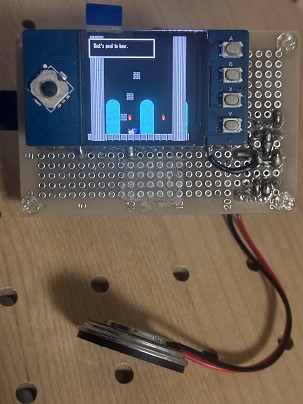
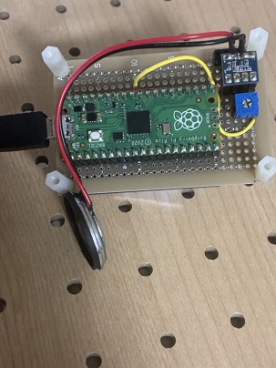

# Playground Test

This is a simple test project for verifying MGC functionality on embedded hardware.

## 🔌 Hardware Used

Using the Waveshare LCD module [Pico-LCD-1.3](https://www.waveshare.com/wiki/Pico-LCD-1.3).  
The microcontroller is a Raspberry Pi Pico (RP2040, no WiFi).





## 🛠️ Setup Instructions (in Ubuntu Container)

```bash
# Install dependencies
apt update
apt install -y python3 python3-venv git wget

# Set up Python environment
python3 -m venv .venv
source .venv/bin/activate
pip install pyyaml pillow

# Set up Pico SDK (optional script)
wget https://raw.githubusercontent.com/raspberrypi/pico-setup/master/pico_setup.sh
chmod +x pico_setup.sh
./pico_setup.sh

# Clone the repository
git clone https://github.com/nyannkov/mgc.git
cd mgc
git submodule update --init --recursive
python3 scripts/setup_assets.py

# Build
cd devtest/playground
./build.sh
```
Copy ./build/playground.elf.uf2 to your Raspberry Pi Pico by dragging and dropping it into the USB mass storage device that appears when the Pico is in boot mode.

## MML (Music Macro Language)
To play background music (BGM) and sound effects (SE), an amplifier module based on the PAM8012 was connected to the PWM output pin of the RP2040, along with a speaker.

For the syntax of the MML (Music Macro Language) used for BGM and SE, please refer to:  
👉 [MML Specification (Psgino)](https://github.com/nyannkov/Psgino/blob/main/MML.md)
