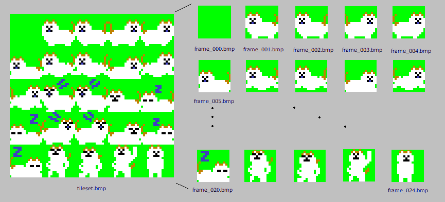

# anim_frame_splitter.py

This script is a utility for splitting indexed-color bitmap tilesets in mgc.  
It cuts a tileset bitmap image into individual tile BMP files, which can then be used by animation generation and viewing tools such as `anim_gen.py` and `anim_viewer.py`.

## How to split a tileset bitmap

The input bitmap image is divided into tiles arranged in a grid, starting from the top-left corner.  
Tiles are extracted row by row, moving left to right, then top to bottom.  

Each extracted tile is saved as a separate BMP file with zero-padded sequential filenames like `frame_000.bmp`, `frame_001.bmp`, etc.

The tile width and height are specified by the user, and the script expects the bitmap size to be a multiple of these dimensions.

<div style="display: flex;">
  
</div>

## Examples of use

```bash
python3 anim_frame_splitter.py ./img/tileset.bmp -w 16 -H 16 -d ./output_tiles
```

In this example, the tileset bitmap tileset.bmp is split into tiles of 16×16 pixels.
The resulting individual tile BMP files are saved in the output_tiles directory.

The width (`-w`) and height (`-H`) options specify the size of each tile in pixels. Both default to 16 if omitted.
The output directory (`-d`) defaults to tiles_out if not specified.

## Notes
The input bitmap must be in indexed color format (palette mode 'P').

Tile width and height must be greater than zero and evenly divide the bitmap dimensions.

The output tiles are saved in BMP format, preserving the original palette.

The script creates the output directory if it does not exist.
