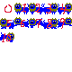
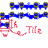

# tileset_gen.py

This script is a utility for handling bitmap images in mgc.
It converts bitmap images in index colour format into mgc_tileset_t structure constants and generates them as C source code.

## How to create a tileset

Tilesets are created by arranging tiles from the top left as shown in the following image.
If the tiles exceed the width of the bitmap image, move the tiles down one level and arrange them from the left.
Note that there is no limit to the width of a bitmap image. A bitmap image can be created with any width and height that is convenient for you.


<div style="display: flex;">
  
  
</div>


## Examples of use.

```bash
python3 tileset_gen.py ./img/ex_tile_count.bmp --dir ./generates --width 16 --height 16 --count 11
```

In this example, from the bitmap image ex_tile_count.bmp, 11 tiles with a width of 16px and a height of 16px are
Converted to mgc_tileset_t structure constants and stored in ./generates as C source code.


The width and height options specify the width and height of the tiles respectively. The default value for both of these is 16px.
The count option specifies the number of tiles in the bitmap image; if count is omitted, the number of tiles is calculated using the following formula.

```python
count = (bitmap_width//tile_width)*(bitmap_height//tile_height)
```

If the count option is set to 1, the width and height of the tile are forced to be converted to the width and height of the bitmap image, respectively.
In the following example, the width and height of the tile are the width and height of the bitmap image, respectively.

```bash
python3 tileset_gen.py ./img/ex_count_1.bmp --dir ./generates --count 1
```

## Notes

 - Bitmap images that can be loaded by scripts are only available in index colour format.
 - Colours with index number 0 are treated as transparent colours.
